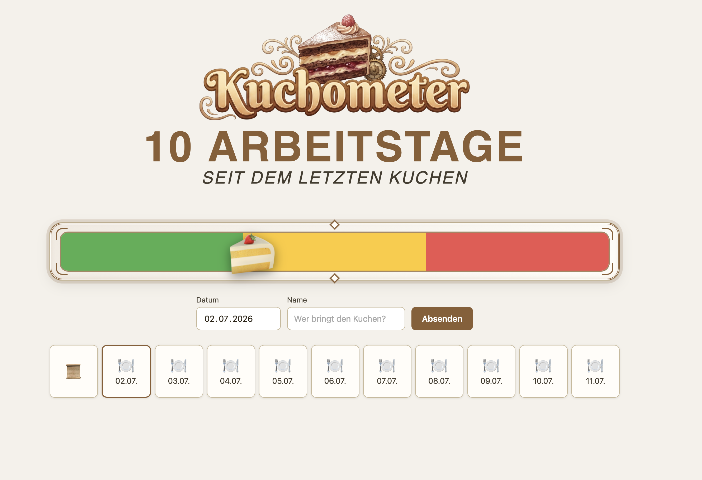

<p align="center">
  
</p>

# Kuchometer

Der **Kuchometer** zählt die Arbeitstage seit dem letzten Bürokuchen – mit Ampel-Barometer, Eintragshistorie und Prognose, wann der nächste Kuchen fällig ist.

<p align="center">
  
</p>

## Starten

```bash
npm install
npm run dev
```

Frontend: [http://localhost:5173](http://localhost:5173) · Mit Docker: `docker compose up`
